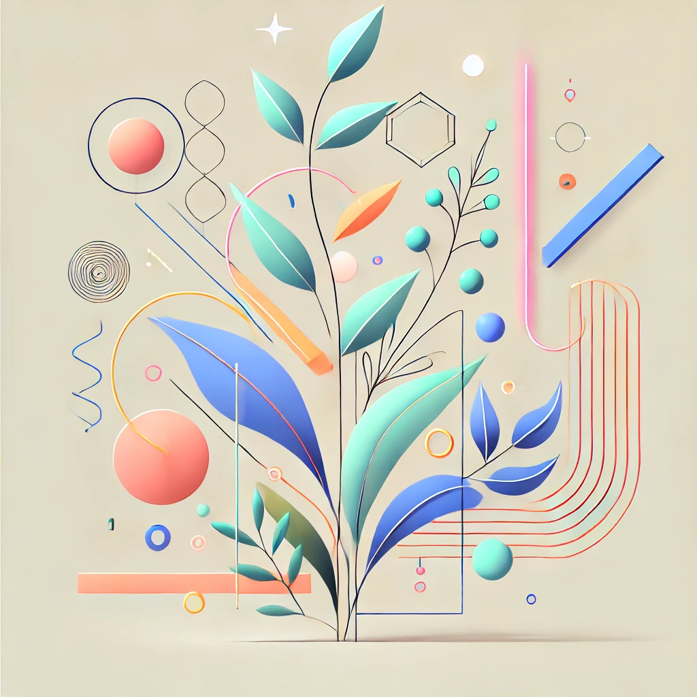
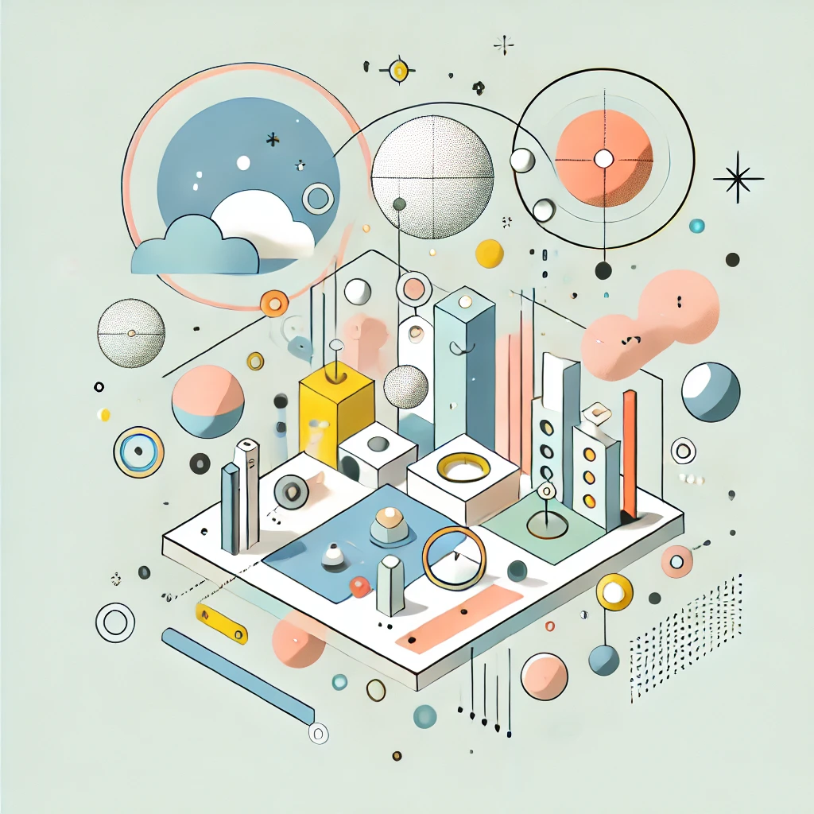

Welcome to my portfolio! Here you'll find three signature series that represent the core of my work and creative vision. Each series showcases a different aspect of my skills in graphic design, digital illustration, and UI/UX design.

## 1. "Neon Nature" - Branding Series

"Neon Nature" is a branding series that fuses organic forms with vibrant, neon-inspired color palettes. This collection showcases my approach to creating bold, memorable brand identities for forward-thinking companies in the tech and environmental sectors.

In this series, I've developed comprehensive brand packages including logos, marketing materials, and digital assets. Each brand identity in "Neon Nature" tells a unique story, balancing the client's values with striking visuals that demand attention in today's crowded market.

[Explore the Neon Nature series](/portfolio/neon-nature)

## 2. "Whimsical Worlds" - Illustration Series

"Whimsical Worlds" is an ongoing illustration series that brings imaginative scenarios to life through detailed, colorful digital artworks. This collection demonstrates my skill in creating immersive, story-rich illustrations for children's books, editorial content, and commercial projects.

Each piece in the "Whimsical Worlds" series is a window into a unique, fantastical universe. From floating cities to underwater civilizations, these illustrations showcase my ability to translate complex ideas into visually engaging scenes that captivate viewers of all ages.

[Dive into the Whimsical Worlds series](/portfolio/whimsical-worlds)

## 3. "Intuitive Interfaces" - UI/UX Design Series

"Intuitive Interfaces" is a series of UI/UX design projects that prioritize user-centric design and seamless digital experiences. This collection highlights my approach to creating interfaces that are not only visually appealing but also highly functional and user-friendly.

The series includes redesigns of mobile applications, e-commerce platforms, and data visualization tools. Each project in "Intuitive Interfaces" demonstrates my process of understanding user needs, iterating on designs, and delivering polished final products that enhance user engagement and satisfaction.

[Explore the Intuitive Interfaces series](/portfolio/intuitive-interfaces)
