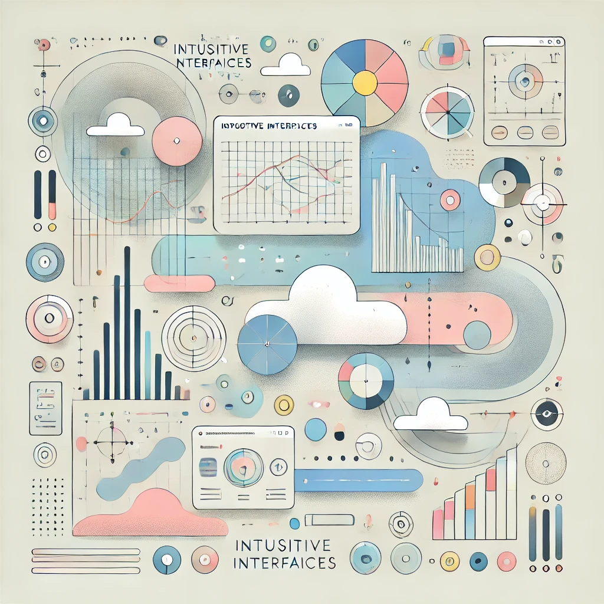

## Overview

"Intuitive Interfaces" is a cornerstone series in my portfolio, representing my passion for creating digital experiences that are both visually striking and effortlessly usable. This collection showcases my approach to UI/UX design, where every pixel and interaction is crafted with the end-user in mind.

In today's digital landscape, an interface isn't just a means to an end—it's an opportunity to delight, engage, and empower users. Through "Intuitive Interfaces," I demonstrate how thoughtful design can transform complex tasks into simple, enjoyable experiences.

## My Process

Each project in this series follows a comprehensive design process:

1. **User Research**: Understanding the target audience, their needs, pain points, and behaviors.
2. **Information Architecture**: Organizing content and features in a logical, easily navigable structure.
3. **Wireframing**: Creating low-fidelity layouts to establish the basic structure of the interface.
4. **Visual Design**: Developing a visually appealing design that aligns with brand guidelines and enhances usability.
5. **Prototyping**: Building interactive prototypes to test and refine the user experience.
6. **User Testing**: Gathering feedback from real users to iterate and improve the design.
7. **Implementation**: Collaborating with developers to ensure the design is implemented accurately and responsively.

## Featured Projects

### 1. HealthTrack App Redesign

HealthTrack, a popular fitness tracking app, approached me to redesign their user interface to improve user engagement and retention. The challenge was to simplify the data visualization while making the tracking process more intuitive and motivating.

**Key Achievements:**

- Redesigned the dashboard to provide a clear overview of daily activities and progress towards goals
- Implemented a new "streak" feature to gamify consistent app usage
- Simplified the workout logging process, reducing the average time to log an activity by 40%
- Introduced personalized insights and recommendations based on user data

**Result:** The redesign led to a 40% increase in daily active users and a 25% improvement in user retention over six months.

### 2. EcoShop E-commerce Platform

EcoShop, an online marketplace for eco-friendly products, needed a user interface that would showcase their products effectively while educating customers about sustainable choices.

**Key Features:**

- Designed an intuitive category and filter system to help users find products easily
- Created visually appealing product pages that highlight eco-friendly features
- Implemented a seamless checkout process with multiple eco-friendly shipping options
- Developed an interactive "sustainability score" system for products

**Result:** The new design saw a 50% increase in conversion rate and a 30% increase in average order value.

### 3. DataViz Dashboard

DataViz, a B2B company providing data analytics services, required a dashboard that could display complex data sets in an easily understandable format for their clients.

**Key Challenges:**

- Simplifying complex data visualizations without losing depth of information
- Creating a customizable interface to cater to different client needs
- Ensuring fast load times despite handling large amounts of data

**Solutions:**

- Implemented a modular dashboard design allowing clients to customize their view
- Created a series of interactive charts and graphs with drill-down capabilities
- Designed an intuitive system for setting up data alerts and generating reports

**Result:** Client satisfaction scores increased by 45%, and the average time spent analyzing data decreased by 30%, indicating improved efficiency.

## The Impact of Intuitive Design

Through the "Intuitive Interfaces" series, I've demonstrated how user-centric design can significantly impact business metrics and user satisfaction. By prioritizing clarity, efficiency, and visual appeal, these interfaces not only meet user needs but also enhance brand perception and drive business growth.
